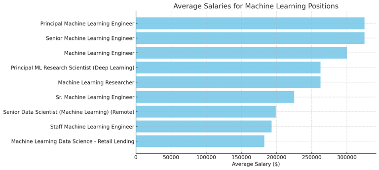

# Introduction
A dive into the data job market with an emphasis on ML (Machine Learning) related roles! This project explores the top-earning positions, top-earning skills and optimal skills (Query 5).

Check out the queries here: [project_sql folder](/project_sql/).

# Background
As a student interested in the world of data-related careers and fields, this project would prove to be illustrative of the skills I should prioritize to maximize the returns of my efforts. Moreover, many students share this position with me, so the queries serve to be versatile.

Data is obtained from the following (public, created by Luke Barousse) [project](https://drive.google.com/drive/folders/1egWenKd_r3LRpdCf4SsqTeFZ1ZdY3DNx). It's packed with insights on job titles, salaries, locations, and essential skills.

### The questions I wanted to answer through my SQL queries were:

1. What are the top-paying ML roles?
2. What skills are required for these top-paying jobs?
3. What skills are most in demand for ML positions?
4. Which skills are associated with higher earners?
5. What are the most optimal (in demand and high earning)skills to learn? 

# Tools I Used
For this in-depth exploration of the ML job market, I utilized the power of several essential tools.

- **SQL:** The backbone of my analysis, allowing me to query the database and unearth critical insights.
- **PostgreSQL:** The chosen database management system, ideal for handling the job posting data.
- **Visual Studio Code:** My go-to for database management and executing SQL queries.
- **Git & GitHub:** Essential for version control and sharing my SQL scripts and analysis, ensuring collaboration and project tracking.

# The Analysis
Each query for this project aimed at answering the above questions of the ML job market.

### 1. Top-Paying Remote ML Jobs.
To identify the highest-paying roles, I filtered ML positions by average yearly salary and location, focusing on remote jobs. This query highlights the high paying (Top 10) opportunities in the field.

```sql
SELECT 
    job_id,
    job_title,
    companies.name as company_name,
    job_location,
    job_schedule_type,
    salary_year_avg
FROM job_postings_fact as roles 
    LEFT JOIN company_dim as companies ON roles.company_id = companies.company_id
WHERE 
    (LOWER(job_title) LIKE '%machine learning%') AND 
    (job_work_from_home IS TRUE) AND 
    (salary_year_avg IS NOT NULL)
ORDER BY 
    salary_year_avg DESC 
LIMIT 10;
```
Here's the breakdown of the top ML jobs in 2023:
- **Salary Range:** Top 10 paying ML roles span from $180,000 to $325,000, indicating significant salary potential in the field.
- **Diverse Employers:** Many companies are offering powerful positions, though **Acceler8 Talent** is taking up 40% of this list.
- **Job Titles:** Of these top 10 positions, 6 are engineers, 2 are reasearch based. This shows the value companies are placing on the growth of their AI departments, rather than the mere existence of these roles,



*Bar graph visualizing the salary for the top 10 salaries for ML; ChatGPT generated this graph from my SQL query results*

### 2. Skills for Top-Paying Remote ML Jobs.
To understand what skills are required for the top-paying jobs, I joined the job postings with the skills data, providing insights into what employers value for high-compensation roles.
```sql
with top_salaries AS ( 
    SELECT 
        job_id,
        job_title,
        companies.name as company_name,
        salary_year_avg
    FROM job_postings_fact as roles 
        LEFT JOIN company_dim as companies 
            ON roles.company_id = companies.company_id
    WHERE 
        (LOWER(job_title) LIKE '%machine learning%') AND 
        (job_work_from_home IS TRUE) AND 
        (salary_year_avg IS NOT NULL)
    ORDER BY 
        salary_year_avg DESC 
    LIMIT 10
)
-- To just display the skills asscociated with the top jobs.

SELECT 
    skills,
    top_salaries.*
FROM top_salaries 
    INNER JOIN skills_job_dim ON top_salaries.job_id = skills_job_dim.job_id
    INNER JOIN skills_dim ON skills_job_dim.skill_id = skills_dim.skill_id
ORDER BY salary_year_avg DESC;

-- Direct count of the necessary skills.

SELECT 
    skills,
    COUNT(*) AS COUNT
FROM top_salaries 
    INNER JOIN skills_job_dim ON top_salaries.job_id = skills_job_dim.job_id
    INNER JOIN skills_dim ON skills_job_dim.skill_id = skills_dim.skill_id
GROUP BY 
    skills
ORDER BY 
    COUNT DESC;
```
Here's the breakdown of the top three most demanded skills for the top 10 highest paying remote ML jobs in 2023:
- **Python** is leading with a bold count of 6.
- **AWS, Excel** follow with 3.

Other skills like **SQL**, **TensorFlow**, **PyTorch**, and **Docker** show varying degrees of demand.

### 3. In-Demand Skills for ML (No condition on being remote).

This query helped identify the skills most frequently requested in job postings, directing focus to areas with high demand.

```sql
SELECT 
    skills,
    COUNT(skills_job_dim.job_id) as DEMAND
FROM job_postings_fact 
INNER JOIN skills_job_dim ON job_postings_fact.job_id = skills_job_dim.job_id
INNER JOIN skills_dim on skills_job_dim.skill_id = skills_dim.skill_id
WHERE 
    LOWER(job_title) LIKE '%machine learning%'
GROUP BY 
    skills
ORDER BY 
    DEMAND DESC
LIMIT 5;
```
Here's the breakdown of the most demanded skills for machine learners in 2023:
- **Python** remains fundamental and imperative, emphasizing the need for strong foundational skills in programming.
- Machine learning specific materials like **TensorFlow** and **PyTorch** along with database/cloud services like **AWS** and **SQL** are also vital, just less-so compared to Python.

|   Skills    | Demand |
|-------------|--------|
| Python      |  9655  |
| TensorFlow  |  4072  |
| PyTorch     |  4030  |
| SQL         |  3927  |
| AWS         |  3559  |

*Table of the demand for the top 5 skills in ML job postings*

### 4. Skills Based on Salary
Which skills are most lucrative? Exploring the average salaries associated with different skills revealed which skills are the highest paying.
```sql
SELECT 
    skills,
    ROUND(AVG(job_postings_fact.salary_year_avg),0) as average_salary
FROM job_postings_fact 
INNER JOIN skills_job_dim ON job_postings_fact.job_id = skills_job_dim.job_id
INNER JOIN skills_dim on skills_job_dim.skill_id = skills_dim.skill_id
WHERE 
    LOWER(job_title) LIKE '%machine learning%' AND
    salary_year_avg IS NOT NULL
GROUP BY 
    skills
ORDER BY 
    average_salary DESC
LIMIT 20;
```
From the table, we can draw these three points:

- **High Salaries for Niche Skills:** Skills related to specialized programming languages and tools like Haskell and Julia command some of the highest average salaries, indicating their high demand and specialized nature.
- **Spreadsheet and Excel Expertise:** Proficiency in spreadsheet tools and Excel remains highly valued, reflecting their importance in data analysis and reporting tasks, which are crucial in many ML-related roles.
- **Configuration Management Tools:** Skills in configuration management tools like Chef, though not directly ML-related, have high earning potential, highlighting the value of expertise in maintaining and automating infrastructure that supports ML workflows.

| Skill          | Average Salary |
|----------------|-----------------|
| Haskell        | $213,000        |
| Julia          | $213,000        |
| Chef           | $212,075        |
| Spreadsheet    | $190,000        |
| Excel          | $182,052        |
| Kotlin         | $181,333        |
| Slack          | $173,074        |
| ggplot2        | $170,000        |
| dplyr          | $170,000        |
| Flow           | $167,436        |

*Table of the average salary for the top 10 paying skills for ML roles*.

### 5. Most Optimal Skills to Learn

Combining insights from demand and salary data, this query aimed to pinpoint skills that are both in high demand and have high salaries, offering a strategic focus for skill development.

```sql
-- Concise Method.
SELECT
    skills_dim.skills AS SKILL,
    COUNT(skills_job_dim.job_id) AS DEMAND_COUNT,
    ROUND(AVG(job_postings_fact.salary_year_avg), 0) AS avg_salary
FROM job_postings_fact
INNER JOIN skills_job_dim ON job_postings_fact.job_id = skills_job_dim.job_id
INNER JOIN skills_dim ON skills_job_dim.skill_id = skills_dim.skill_id
WHERE
    salary_year_avg IS NOT NULL AND
    LOWER(job_title) LIKE '%machine learning%'
GROUP BY
    SKILL
HAVING 
    COUNT(skills_job_dim.job_id) > 10
ORDER BY
    avg_salary DESC,
    DEMAND_COUNT DESC
LIMIT 25;

-- CTE method.

WITH skills_demand AS (
    SELECT 
        skills_dim.skill_id,
        skills_dim.skills,
        COUNT(skills_job_dim.job_id) as DEMAND
    FROM job_postings_fact 
    INNER JOIN skills_job_dim ON job_postings_fact.job_id = skills_job_dim.job_id
    INNER JOIN skills_dim on skills_job_dim.skill_id = skills_dim.skill_id
    WHERE 
        LOWER(job_title) LIKE '%machine learning%' AND 
        salary_year_avg IS NOT NULL
    GROUP BY 
        skills_dim.skill_id, skills
), average_salary AS (
    SELECT 
        skills_dim.skill_id,
        skills_dim.skills,
        ROUND(AVG(job_postings_fact.salary_year_avg),0) as avg_salary
    FROM job_postings_fact 
    INNER JOIN skills_job_dim ON job_postings_fact.job_id = skills_job_dim.job_id
    INNER JOIN skills_dim on skills_job_dim.skill_id = skills_dim.skill_id
    WHERE 
        LOWER(job_title) LIKE '%machine learning%' AND
        salary_year_avg IS NOT NULL
    GROUP BY 
        skills_dim.skill_id, skills
)
SELECT
    skills_demand.skills,
    DEMAND,
    avg_salary
FROM skills_demand 
INNER JOIN average_salary ON skills_demand.skill_id = average_salary.skill_id
ORDER BY 
    DEMAND DESC,
    avg_salary DESC
LIMIT 15; 
```

| Skill         | Demand Count | Average Salary |
|---------------|--------------|----------------|
| Excel         | 22           | $182,052       |
| Flow          | 16           | $167,436       |
| SQL           | 156          | $151,142       |
| Scala         | 45           | $150,397       |
| Hadoop        | 49           | $149,759       |
| Spark         | 122          | $147,202       |
| R             | 73           | $146,946       |
| Kubernetes    | 73           | $146,516       |
| PyTorch       | 161          | $144,056       |
| TensorFlow    | 164          | $143,245       |
| Python        | 369          | $142,753       |
| Databricks    | 39           | $142,033       |
| Java          | 98           | $141,490       |
| Go            | 48           | $140,572       |
| GCP           | 54           | $140,190       |
| Airflow       | 54           | $138,872       |
| Terraform     | 21           | $138,641       |
| BigQuery      | 18           | $138,241       |
| AWS           | 148          | $137,901       |
| Docker        | 92           | $137,447       |
| C++           | 47           | $136,949       |
| Scikit-learn  | 75           | $136,805       |
| Kafka         | 32           | $136,800       |
| Snowflake     | 16           | $136,527       |
| MongoDB       | 20           | $135,353       |

*Table of the most optimal skills for ML sorted by salary*

# What I Learned

Throughout this adventure, I've turbocharged my SQL toolkit with some serious firepower:

- **Complex Query Crafting:** Mastered the art of advanced SQL, merging tables like a pro and wielding WITH clauses for ninja-level temp table maneuvers.
- **Data Aggregation:** Got cozy with GROUP BY and turned aggregate functions like COUNT() and AVG() into my data-summarizing sidekicks.
- **Analytics:** Leveled up my real-world puzzle-solving skills, turning questions into actionable, insightful SQL queries.

# Conclusions

### Insights
From the analysis, several general insights emerged:

1. **Top-Paying ML Jobs**: The highest-paying jobs for MLs that allow remote work offer a wide range of salaries, the highest at $325,000!
2. **Skills for Top-Paying Jobs**: High-paying ML jobs require Python as a minimum, though also require cloud based skills along with AI specific packages.
3. **Most In-Demand Skills**: Python is also the most demanded skill in the ML job market, thus making it essential for job seekers.
4. **Skills with Higher Salaries**: Specialized skills, such as Haskell and Julia, are associated with the highest average salaries, indicating a premium on niche expertise.
5. **Optimal Skills for Job Market Value**: Python and it's ML/AI libraries, cloud-based services and other specific requirements (R, Excel) make up the table for optimal jobs with a varying degree of salary to demand ratios.

### Closing Thoughts

This project enhanced my SQL skills and provided valuable insights into the ML job market. The findings from the analysis serve as a guide to prioritizing skill development and job search efforts. Aspiring machine learning engineers and others can better position themselves in a competitive job market by focusing on high-demand, high-salary skills. This exploration highlights the importance of continuous learning and adaptation to emerging trends in the field of data analytics.
